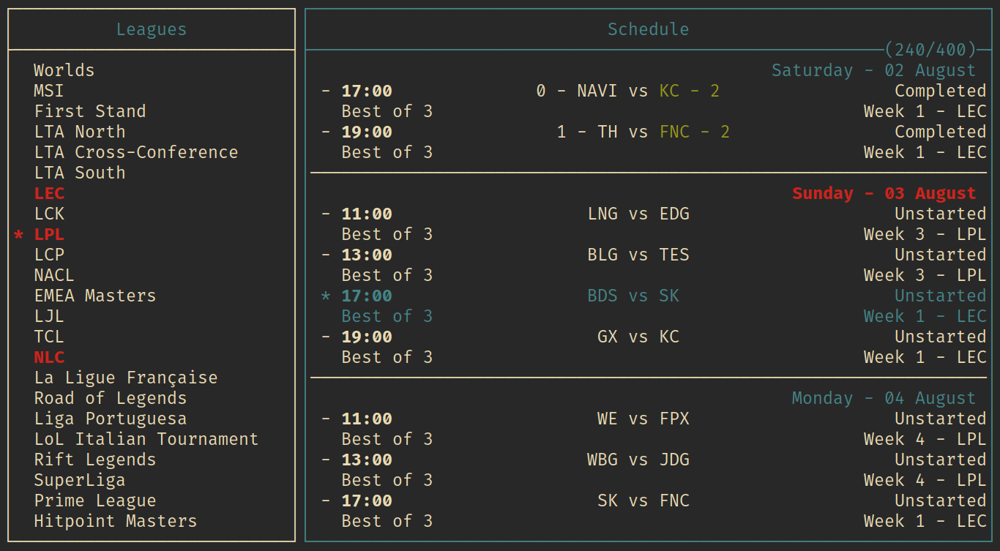

# lol-cal



A lolesports schedule viewer for your terminal.
I found the lolesports schedule site to be slow, filled with unnecessary information 
and cumbersome to use, so i made a terminal interface for it instead.
The program fetches data from the lolesports backend, and displays it in a customizable TUI.
All data is cached and is only reacquired when it is necessary, keeping outbounding requests to a minimum.

### runing
```sh
cargo run
```
duh

## config
The program looks for the config file at ```$XDG_CONFIG_HOME/lol-cal/config``` on linux.
Windows and macOS are also theoreticly supported, though they are untested.
The config file has ini-like syntax. Following are the configurable 

### settings
| setting          | default | description                                                                                            |
|------------------|---------|--------------------------------------------------------------------------------------------------------|
| default_leagues  | NONE    | a comma seperated list of leagues that are loaded on entry, Ex: ```LEC, LPL, LTA North```              |
| spoil_results    | false   | shows the results of completed matches, can be toggled with a keybind                                  |
| spoil_matches    | true    | show the names of teams in unplayed matches, can be toggled with a keybind                             |
| automatic_reload | true    | automaticle fetch data when a league is selected, can be turned of and manually fetched with a keybind |

### keybindings
| key       | default            | description                              |
|-----------|--------------------|------------------------------------------|
| q         | Quit               | exit the program                         |
| up / k    | Up                 | navigate up                              |
| down / j  | Down               | navigate down                            |
| left / h  | Left               | navigate left                            |
| right / l | Right              | navigate right                           |
| space     | Select             | select the selected item                 |
| Ctrl-g    | GotoToday          | select first upcoming match              |
| Ctrl-s    | ToggleSpoilResults | toggles the spoiling of results          |
| Shift-s   | ToggleSpoilMatches | toggles the spoiling of unplayed matches |

### style
| style     | default    | description                                                     |
|-----------|------------|-----------------------------------------------------------------|
| border    | plain      | border style, one of: ```plain, rounded, double, thick, none``` |
| default   | white      | default foreground color                                        |
| highlight | blue       | highlight color                                                 |
| winner    | bold green | winner color                                                    |
| loser     | red        | loser color                                                     |
| selected  | bold red   | selected color                                                  |

#### colors
Colors are either the name of a standard 4-bit terminal color, listed below, or a 256-bit hex color code, Ex: ```#45f3a2```.
Colors can also be modified with the bold tag.

| 4-bit colors        |
|---------------------|
| black               |
| red                 |
| green               |
| yellow              |
| blue                |
| magenta             |
| cyan                |
| gray                |
| bright black        |
| bright red          |
| bright green        |
| bright yellow       |
| bright blue         |
| bright magenta      |
| bright cyan         |
| white               |

### example config file


```ini
[settings]
default_leagues = LEC, LPL, LTA North
spoil_results = yes
spoil_matches = yes
automatic_reload = true

[keybindings]
q = Quit
Ctrl-d = Quit
Ctrl-c = Quit

Ctrl-g = GotoToday
Ctrl-s = ToggleSpoilResults
Shift-s = ToggleSpoilMatches

r = ReloadSchedule

k = Up
j = Down
h = Left
l = Right
space = Select

[style]
border = plain
default = gray
highlight = white on black
winner = bold white
loser = white
selected = bold white
```

## TODO
- make a command line interface for scripting
- make a standings tab, to view tournament / league standings
- more flexible layout options?
- a selected match field / area?
- export to calendar format?
- man page for better documentation
